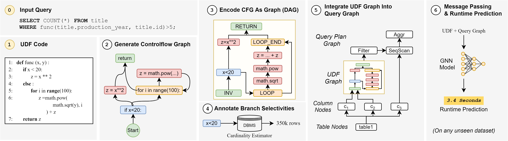
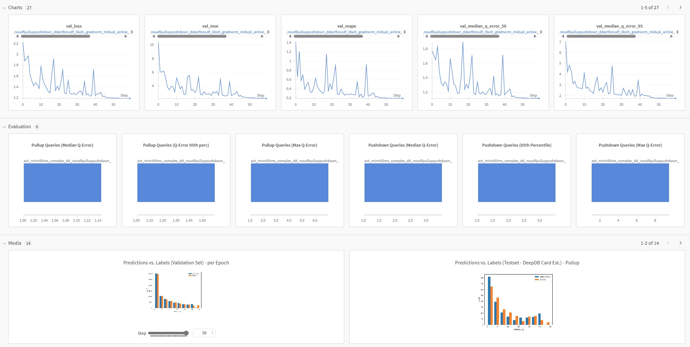

# Graceful

Sourcecode of our ICE '25 paper "GRACEFUL: A Learned Cost Estimator For UDFs"

<p align="center">
  
</p>

## Citation

Please cite our paper if you find this work useful or use it in your own research:

```
TODO
```

# Table of contents

1. [Main Modules](#main-modules)
2. [Prerequisites](#prerequisites)
3. [Reproducing the Experiments](#reproducing-the-experiments)
4. [Flat Vector Baseline](#flat-vector-baseline)
5. [Add custom databases or workloads](#add-custom-databases-or-workloads)

# Main Modules

| Module             | Description                                                                                |
|--------------------|--------------------------------------------------------------------------------------------|
| cross_db_benchmark | All code required to reproduce the DBGen benchmark (workload generator, executor, parsing) |
| models             | GRACEFUL model code                                                                        |
| prepare_db         | All code required to extracti db statistic, clean the db, ...                              |
| setup              | Model hyperparameters and commands to execute DBGen Benchmark                              |
| udf_generator      | Code to generate UDFs                                                                      |
| udf_graph          | Code to generate and annotate UDF graphs                                                   |
| utils              | Utility functions used throughout the codebase                                             |

# Prerequisites

## Python dependencies:

For running the commands in this repository, please install the required libraries defined in the `requirements.txt`
file.
(Please make sure that both `graphviz` and `graphviz-dev` are available on your system, e.g. install via
`sudo apt install graphviz graphviz-dev`)

## Download Benchmark & Datasets

You can download the following artifacts to fast-forward the setup process all
from [here](https://osf.io/27ghj/?view_only=7b239f37992e4b7a9f9788b4fdcb17e1).
This includes:

- Collected Query traces: Preprocessed and annotated query Traces of the executed workloads (ready to directly train the
  model)
- UDF benchmark: UDF workload files including the UDF code as well as the surrounding SQL queries for the 20 datasets
- GRACEFUL Artifacts: Artifacts of the GRACEFUL model used for UDF cost estimation
- DuckDB database files (.db) - for the 20 datasets we use
- DeepDB Artifacts: Artifacts of the DeepDB model used for cardinality estimation

After downloading extract the zip files using the script `python workload_runs/extract_zips.py` (shipped with the data).

# Reproducing the Experiments

## Running the UDF Plan Advisor (using pre-trained cost models)

This will use pre-trained models shipped with the data.

```bash
python evaluate_pull_up_predictor.py --pullup_plans_path ../Graceful_data/workload_runs/duckdb_pullup/parsed_plans/genome/workload.json --pushdown_plans_path ../Graceful_data/workload_runs/duckdb_pushdown/parsed_plans/genome/workload.json --model_dir ../Graceful_data/graceful_artifacts/leave_out_genome --model_name act_minrt50ms_complex_dd_wpullupdata_wnoUDFdata_ddactfonudf_liboh_gradnorm_mldupl_loopend_loopedge_genome_stratDBs_ep60_maxr30_20240503_115437_074 --device cuda:0 --statistics_file ../Graceful_data/workload_runs/duckdb_pushdown/parsed_plans/statistics_workload_combined.json --model_config ddactfonudf_liboh_gradnorm_mldupl_loopend_loopedge --dataset genome
python evaluate_pull_up_predictor.py --pullup_plans_path ../Graceful_data/workload_runs/duckdb_pullup/parsed_plans/airline/workload.json --pushdown_plans_path ../Graceful_data/workload_runs/duckdb_pushdown/parsed_plans/airline/workload.json --model_dir ../Graceful_data/graceful_artifacts/leave_out_airline --model_name act_minrt50ms_complex_dd_wpullupdata_wnoUDFdata_ddactfonudf_liboh_gradnorm_mldupl_loopend_loopedge_airline_stratDBs_ep60_maxr30_20240503_020205_034 --device cuda:0 --statistics_file ../Graceful_data/workload_runs/duckdb_pushdown/parsed_plans/statistics_workload_combined.json --model_config ddactfonudf_liboh_gradnorm_mldupl_loopend_loopedge --dataset genome
python evaluate_pull_up_predictor.py --pullup_plans_path ../Graceful_data/workload_runs/duckdb_pullup/parsed_plans/financial/workload.json --pushdown_plans_path ../Graceful_data/workload_runs/duckdb_pushdown/parsed_plans/financial/workload.json --model_dir ../Graceful_data/graceful_artifacts/leave_out_financial --model_name act_minrt50ms_complex_dd_wpullupdata_wnoUDFdata_ddactfonudf_liboh_gradnorm_mldupl_loopend_loopedge_financial_stratDBs_ep60_maxr30_20240501_093145_013 --device cuda:0 --statistics_file ../Graceful_data/workload_runs/duckdb_pushdown/parsed_plans/statistics_workload_combined.json --model_config ddactfonudf_liboh_gradnorm_mldupl_loopend_loopedge --dataset genome
python evaluate_pull_up_predictor.py --pullup_plans_path ../Graceful_data/workload_runs/duckdb_pullup/parsed_plans/movielens/workload.json --pushdown_plans_path ../Graceful_data/workload_runs/duckdb_pushdown/parsed_plans/movielens/workload.json --model_dir ../Graceful_data/graceful_artifacts/leave_out_movielens --model_name act_minrt50ms_complex_dd_wpullupdata_wnoUDFdata_ddactfonudf_liboh_gradnorm_mldupl_loopend_loopedge_movielens_stratDBs_ep60_maxr30_20240501_093101_065 --device cuda:0 --statistics_file ../Graceful_data/workload_runs/duckdb_pushdown/parsed_plans/statistics_workload_combined.json --model_config ddactfonudf_liboh_gradnorm_mldupl_loopend_loopedge --dataset genome
python evaluate_pull_up_predictor.py --pullup_plans_path ../Graceful_data/workload_runs/duckdb_pullup/parsed_plans/fhnk/workload.json --pushdown_plans_path ../Graceful_data/workload_runs/duckdb_pushdown/parsed_plans/fhnk/workload.json --model_dir ../Graceful_data/graceful_artifacts/leave_out_fhnk --model_name act_minrt50ms_complex_dd_wpullupdata_wnoUDFdata_ddactfonudf_liboh_gradnorm_mldupl_loopend_loopedge_fhnk_stratDBs_ep60_maxr30_20240501_093224_088 --device cuda:0 --statistics_file ../Graceful_data/workload_runs/duckdb_pushdown/parsed_plans/statistics_workload_combined.json --model_config ddactfonudf_liboh_gradnorm_mldupl_loopend_loopedge --dataset genome
python evaluate_pull_up_predictor.py --pullup_plans_path ../Graceful_data/workload_runs/duckdb_pullup/parsed_plans/employee/workload.json --pushdown_plans_path ../Graceful_data/workload_runs/duckdb_pushdown/parsed_plans/employee/workload.json --model_dir ../Graceful_data/graceful_artifacts/leave_out_employee --model_name act_minrt50ms_complex_dd_wpullupdata_wnoUDFdata_ddactfonudf_liboh_gradnorm_mldupl_loopend_loopedge_employee_stratDBs_ep60_maxr30_20240501_093236_083 --device cuda:0 --statistics_file ../Graceful_data/workload_runs/duckdb_pushdown/parsed_plans/statistics_workload_combined.json --model_config ddactfonudf_liboh_gradnorm_mldupl_loopend_loopedge --dataset genome
python evaluate_pull_up_predictor.py --pullup_plans_path ../Graceful_data/workload_runs/duckdb_pullup/parsed_plans/ssb/workload.json --pushdown_plans_path ../Graceful_data/workload_runs/duckdb_pushdown/parsed_plans/ssb/workload.json --model_dir ../Graceful_data/graceful_artifacts/leave_out_ssb --model_name act_minrt50ms_complex_dd_wpullupdata_wnoUDFdata_ddactfonudf_liboh_gradnorm_mldupl_loopend_loopedge_ssb_stratDBs_ep60_maxr30_20240502_141949_072 --device cuda:0 --statistics_file ../Graceful_data/workload_runs/duckdb_pushdown/parsed_plans/statistics_workload_combined.json --model_config ddactfonudf_liboh_gradnorm_mldupl_loopend_loopedge --dataset genome
python evaluate_pull_up_predictor.py --pullup_plans_path ../Graceful_data/workload_runs/duckdb_pullup/parsed_plans/baseball/workload.json --pushdown_plans_path ../Graceful_data/workload_runs/duckdb_pushdown/parsed_plans/baseball/workload.json --model_dir ../Graceful_data/graceful_artifacts/leave_out_baseball --model_name act_minrt50ms_complex_dd_wpullupdata_wnoUDFdata_ddactfonudf_liboh_gradnorm_mldupl_loopend_loopedge_baseball_stratDBs_ep60_maxr30_20240503_101832_095 --device cuda:0 --statistics_file ../Graceful_data/workload_runs/duckdb_pushdown/parsed_plans/statistics_workload_combined.json --model_config ddactfonudf_liboh_gradnorm_mldupl_loopend_loopedge --dataset genome
python evaluate_pull_up_predictor.py --pullup_plans_path ../Graceful_data/workload_runs/duckdb_pullup/parsed_plans/walmart/workload.json --pushdown_plans_path ../Graceful_data/workload_runs/duckdb_pushdown/parsed_plans/walmart/workload.json --model_dir ../Graceful_data/graceful_artifacts/leave_out_walmart --model_name act_minrt50ms_complex_dd_wpullupdata_wnoUDFdata_ddactfonudf_liboh_gradnorm_mldupl_loopend_loopedge_walmart_stratDBs_ep60_maxr30_20240502_134902_066 --device cuda:0 --statistics_file ../Graceful_data/workload_runs/duckdb_pushdown/parsed_plans/statistics_workload_combined.json --model_config ddactfonudf_liboh_gradnorm_mldupl_loopend_loopedge --dataset genome
python evaluate_pull_up_predictor.py --pullup_plans_path ../Graceful_data/workload_runs/duckdb_pullup/parsed_plans/credit/workload.json --pushdown_plans_path ../Graceful_data/workload_runs/duckdb_pushdown/parsed_plans/credit/workload.json --model_dir ../Graceful_data/graceful_artifacts/leave_out_credit --model_name act_minrt50ms_complex_dd_wpullupdata_wnoUDFdata_ddactfonudf_liboh_gradnorm_mldupl_loopend_loopedge_credit_stratDBs_ep60_maxr30_20240501_093221_046 --device cuda:0 --statistics_file ../Graceful_data/workload_runs/duckdb_pushdown/parsed_plans/statistics_workload_combined.json --model_config ddactfonudf_liboh_gradnorm_mldupl_loopend_loopedge --dataset genome
python evaluate_pull_up_predictor.py --pullup_plans_path ../Graceful_data/workload_runs/duckdb_pullup/parsed_plans/consumer/workload.json --pushdown_plans_path ../Graceful_data/workload_runs/duckdb_pushdown/parsed_plans/consumer/workload.json --model_dir ../Graceful_data/graceful_artifacts/leave_out_consumer --model_name act_minrt50ms_complex_dd_wpullupdata_wnoUDFdata_ddactfonudf_liboh_gradnorm_mldupl_loopend_loopedge_consumer_stratDBs_ep60_maxr30_20240502_160244_008 --device cuda:0 --statistics_file ../Graceful_data/workload_runs/duckdb_pushdown/parsed_plans/statistics_workload_combined.json --model_config ddactfonudf_liboh_gradnorm_mldupl_loopend_loopedge --dataset genome
python evaluate_pull_up_predictor.py --pullup_plans_path ../Graceful_data/workload_runs/duckdb_pullup/parsed_plans/tournament/workload.json --pushdown_plans_path ../Graceful_data/workload_runs/duckdb_pushdown/parsed_plans/tournament/workload.json --model_dir ../Graceful_data/graceful_artifacts/leave_out_tournament --model_name act_minrt50ms_complex_dd_wpullupdata_wnoUDFdata_ddactfonudf_liboh_gradnorm_mldupl_loopend_loopedge_tournament_stratDBs_ep60_maxr30_20240502_141825_069 --device cuda:0 --statistics_file ../Graceful_data/workload_runs/duckdb_pushdown/parsed_plans/statistics_workload_combined.json --model_config ddactfonudf_liboh_gradnorm_mldupl_loopend_loopedge --dataset genome
python evaluate_pull_up_predictor.py --pullup_plans_path ../Graceful_data/workload_runs/duckdb_pullup/parsed_plans/carcinogenesis/workload.json --pushdown_plans_path ../Graceful_data/workload_runs/duckdb_pushdown/parsed_plans/carcinogenesis/workload.json --model_dir ../Graceful_data/graceful_artifacts/leave_out_carcinogenesis --model_name act_minrt50ms_complex_dd_wpullupdata_wnoUDFdata_ddactfonudf_liboh_gradnorm_mldupl_loopend_loopedge_carcinogenesis_stratDBs_ep60_maxr30_20240502_160202_085 --device cuda:0 --statistics_file ../Graceful_data/workload_runs/duckdb_pushdown/parsed_plans/statistics_workload_combined.json --model_config ddactfonudf_liboh_gradnorm_mldupl_loopend_loopedge --dataset genome
python evaluate_pull_up_predictor.py --pullup_plans_path ../Graceful_data/workload_runs/duckdb_pullup/parsed_plans/seznam/workload.json --pushdown_plans_path ../Graceful_data/workload_runs/duckdb_pushdown/parsed_plans/seznam/workload.json --model_dir ../Graceful_data/graceful_artifacts/leave_out_seznam --model_name act_minrt50ms_complex_dd_wpullupdata_wnoUDFdata_ddactfonudf_liboh_gradnorm_mldupl_loopend_loopedge_seznam_stratDBs_ep60_maxr30_20240502_160216_072 --device cuda:0 --statistics_file ../Graceful_data/workload_runs/duckdb_pushdown/parsed_plans/statistics_workload_combined.json --model_config ddactfonudf_liboh_gradnorm_mldupl_loopend_loopedge --dataset genome
python evaluate_pull_up_predictor.py --pullup_plans_path ../Graceful_data/workload_runs/duckdb_pullup/parsed_plans/geneea/workload.json --pushdown_plans_path ../Graceful_data/workload_runs/duckdb_pushdown/parsed_plans/geneea/workload.json --model_dir ../Graceful_data/graceful_artifacts/leave_out_geneea --model_name act_minrt50ms_complex_dd_wpullupdata_wnoUDFdata_ddactfonudf_liboh_gradnorm_mldupl_loopend_loopedge_geneea_stratDBs_ep60_maxr30_20240501_093236_018 --device cuda:0 --statistics_file ../Graceful_data/workload_runs/duckdb_pushdown/parsed_plans/statistics_workload_combined.json --model_config ddactfonudf_liboh_gradnorm_mldupl_loopend_loopedge --dataset genome
python evaluate_pull_up_predictor.py --pullup_plans_path ../Graceful_data/workload_runs/duckdb_pullup/parsed_plans/accidents/workload.json --pushdown_plans_path ../Graceful_data/workload_runs/duckdb_pushdown/parsed_plans/accidents/workload.json --model_dir ../Graceful_data/graceful_artifacts/leave_out_accidents --model_name act_minrt50ms_complex_dd_wpullupdata_wnoUDFdata_ddactfonudf_liboh_gradnorm_mldupl_loopend_loopedge_accidents_stratDBs_ep60_maxr30_20240502_160102_051 --device cuda:0 --statistics_file ../Graceful_data/workload_runs/duckdb_pushdown/parsed_plans/statistics_workload_combined.json --model_config ddactfonudf_liboh_gradnorm_mldupl_loopend_loopedge --dataset genome
python evaluate_pull_up_predictor.py --pullup_plans_path ../Graceful_data/workload_runs/duckdb_pullup/parsed_plans/imdb/workload.json --pushdown_plans_path ../Graceful_data/workload_runs/duckdb_pushdown/parsed_plans/imdb/workload.json --model_dir ../Graceful_data/graceful_artifacts/leave_out_imdb --model_name act_minrt50ms_complex_dd_wpullupdata_wnoUDFdata_ddactfonudf_liboh_gradnorm_mldupl_loopend_loopedge_imdb_stratDBs_ep60_maxr30_20240502_142026_057 --device cuda:0 --statistics_file ../Graceful_data/workload_runs/duckdb_pushdown/parsed_plans/statistics_workload_combined.json --model_config ddactfonudf_liboh_gradnorm_mldupl_loopend_loopedge --dataset genome
python evaluate_pull_up_predictor.py --pullup_plans_path ../Graceful_data/workload_runs/duckdb_pullup/parsed_plans/hepatitis/workload.json --pushdown_plans_path ../Graceful_data/workload_runs/duckdb_pushdown/parsed_plans/hepatitis/workload.json --model_dir ../Graceful_data/graceful_artifacts/leave_out_hepatitis --model_name act_minrt50ms_complex_dd_wpullupdata_wnoUDFdata_ddactfonudf_liboh_gradnorm_mldupl_loopend_loopedge_hepatitis_stratDBs_ep60_maxr30_20240502_141851_092 --device cuda:0 --statistics_file ../Graceful_data/workload_runs/duckdb_pushdown/parsed_plans/statistics_workload_combined.json --model_config ddactfonudf_liboh_gradnorm_mldupl_loopend_loopedge --dataset genome
python evaluate_pull_up_predictor.py --pullup_plans_path ../Graceful_data/workload_runs/duckdb_pullup/parsed_plans/basketball/workload.json --pushdown_plans_path ../Graceful_data/workload_runs/duckdb_pushdown/parsed_plans/basketball/workload.json --model_dir ../Graceful_data/graceful_artifacts/leave_out_basketball --model_name act_minrt50ms_complex_dd_wpullupdata_wnoUDFdata_ddactfonudf_liboh_gradnorm_mldupl_loopend_loopedge_basketball_stratDBs_ep60_maxr30_20240503_015928_050 --device cuda:0 --statistics_file ../Graceful_data/workload_runs/duckdb_pushdown/parsed_plans/statistics_workload_combined.json --model_config ddactfonudf_liboh_gradnorm_mldupl_loopend_loopedge --dataset genome
python evaluate_pull_up_predictor.py --pullup_plans_path ../Graceful_data/workload_runs/duckdb_pullup/parsed_plans/tpc_h/workload.json --pushdown_plans_path ../Graceful_data/workload_runs/duckdb_pushdown/parsed_plans/tpc_h/workload.json --model_dir ../Graceful_data/graceful_artifacts/leave_out_tpc_h --model_name act_minrt50ms_complex_dd_wpullupdata_wnoUDFdata_ddactfonudf_liboh_gradnorm_mldupl_loopend_loopedge_tpc_h_stratDBs_ep60_maxr30_20240501_093049_070 --device cuda:0 --statistics_file ../Graceful_data/workload_runs/duckdb_pushdown/parsed_plans/statistics_workload_combined.json --model_config ddactfonudf_liboh_gradnorm_mldupl_loopend_loopedge --dataset genome
```

## Retraining Cost-Est Models

For training the model please generate the experiment commands using the `gen_train_commands.py` helper file. This
includes the model configurations for the ablation study and the leave-one-out experiments.

```bash
python gen_train_commands.py --artifacts_path ../Graceful_data/graceful_artifacts/ --wl_base_path ../Graceful_data/workload_runs/
```

### Logging to Weights&Biases (wandb.ai)

To log the training process to Weights&Biases, please login to wandb using `wandb login` and set the
`--register_run_at_wandb` flag in the training command. Please specify username (entity) and project name in the
`--wandb_entity` and `--wandb_project` arguments.

An example run can be seen here: https://wandb.ai/jwehrstein/GRACEFUL

<p align="center">
  
</p>

# Add custom databases or workloads

We provide precreated .duckdb files. These databases come already prepared with the necessary data and are ready to be
used.
If you want to use custom datasets, please execute the following preprocessing steps for your DBMS:

### 1. Extract Meta stats about your database

Extract meta stats from the DBs. This includes information about the tables and columns in the DBs.
```python udf_generator/create_db_statistics.py --dbms duckdb --dbms_kwargs dir=../Graceful_data/datasets/ --col_stats_dir ../Graceful_data/datasets/statistics/ --target ../Graceful_data/datasets/DB_metadata.csv```

### 2. DB cleaning / Fit dataset semantically to the UDFs that will be generated (optional)

This will apply data cleaning and preprocessing steps making the data fit more to the UDFs that will be generated. This
will reduce the data collection effort, since less errors will appear during query execution. However this step is not
necessary.

Clean the DB. This is done by running the following command:
```python3 clean_DBs.py --work_dir ../Graceful_data/datasets/ --dbms_kwargs dir=../Graceful_data/datasets/```

### 3. Regenerate Meta Stats for Cleaned DBs

Regenerate the meta stats again (Step 1) to reflect the updates made during the cleaning process.

### 4. Column / String stats

Extract column and string statistics:

```
python3 gen_dataset_stats.py --data_dir /path/to/your/csv/files/ --work_dir ../Graceful_data/datasets/ --dbs zs_less_scaled --dbms duckdb --dbms_kwargs dir=/duckdb_dir/
```

### 5. Setup Folder Structure

Next, we need to set up an experiment folder. This folder will be used to store the UDFs, the graphs, and the feature
statistics. The following command will create the folder structure:
```python3 udf_generator/generate_udf_wl.py --setup True --experiment_dir ~/experiments --exp_name test_exp```

### 6. Generate SQL Queries (skip if you want to work with SELECT-only queries)

In this step, we generate the SQL queries that will be used to create the UDFs.
This is done by running the following command:
```python3 dbgensetup.py --generate_workloads --workload_dir ../Graceful_data/workload_runs/my_run/dbs --col_stats_dir ../Graceful_data/datasets/statistics/```

### 7. UDF generation

#### 7.1 with SELECT-only SQL queries

Next, we need to generate the UDFs. This is done by running the following command:
```python3 generate_udf_wl.py --exp_name test_exp --no_funcs 1000 --exact_tree {True|False}```

In the example above, we will create 1000 queries with a different randomly generated UDF for each query
The parameter ```--exact_tree``` indicates whether we want to create UDFs with an exact tree structure consisting of all
components (COMP, LOOP, IF) (```True```) or with tree structure that might be a subset of the the set (COMP, LOOP,
IF) (```False```)

#### 7.2 For previously create SPAJ queries

If we want to create UDFs for already created **SPJA queries**, run the following command:
```python3 generate_udf_wl.py --metafile_name udf_stats.json --exp_name test_exp --no_funcs 1000 --exact_tree {True|False}```
Here, we leverage information about the UDFs that we are about to create; this information is stored in udf_stats.json
This information includes, e.g., information about the columns that are used in the UDFs

### 8. Query Execution + Plan Parsing

Once we have obtained/created the UDFs and the corresponding queries, we need to run these workload to gather the
training data.

Execute queries:
```python3 run_benchmark.py --run_workload --source ../Graceful_data/workload_runs/my_run/dbs/[db_name]/sql_scripts/[source_file_name].sql --target ../Graceful_data/workload_runs/my_run/raw/[db_name]/workload.json --database duckdb --db_name [db_name] --databse_conn dir=/duckdb_dir/ --run_kwargs hardware=my_fancy_machine --min_query_ms 100 --query_timeout 30 --repetitions_per_query 1 --udf_load_path ../Graceful_data/workload_runs/my_run/dbs/[db_name]/sql_scripts/udfs.sql --udf_drop_path ../Graceful_data/workload_runs/my_run/dbs/[db_name]/sql_scripts/dropUDFs.sql --cap_workload 5000```

If the SQL queries contain pull-up queries, please set the `--pullup_udf` flag. This will enforce that duckdb will not
apply filter-pushdown rules on the UDF.

Parse queries:
```python3 parse_plans.py --raw_dir ../Graceful_data/workload_runs/my_run/raw/ --parsed_plan_dir ../Graceful_data/workload_runs/my_run/parsed_plans/ --workloads workload.json --out_names workload.json --databse duckdb --duckdb_dir ../Graceful_data/datasets/ --min_query_ms 100 --udf_code_location ..Graceful_data/worload_runs/my_run/dbs/ --cap_queries 5000 --dataset [db_name] --deepdb_artifacts_dir ../Graceful_data/deepdb_artifacts```

This will as well automatically annotate cardinality estimates from DeepDB and Wanderjoin. To deactivate this annotation
step, add `--skip_wj` and `--skip_deepdb` to the command.

### 9. Graph Creation

To prepare model training, we need to parse the UDF code and create the graphs. This is done by running the following
command:
```python3 create_udf_graph.py --exp_folder ../Graceful_data/workload_runs/duckdb_pushdown --dataset [db_name]  --dbms_kwargs dir=../Graceful_data/datasets/ --duckdb_dir ../Graceful_data/datasets/ e --deepdb_dir ../Graceful_data/deepdb_artifacts --add_loop_end_node```

This command will create a graph for each UDF that was part of a successfully executed query.
The graphs are stored in the experiment folder that was created in a previous step; when training/evaluating the model,
The graphs of the UDFs are loaded from this location.
The parameter `--add_loop_end_node` is optional and adds a node to the graph that represents the end of a loop.
The filenames of the graph mark the UDFs that were used to create the graph and whether the graph was created with or
without the `--add_loop_end_node` parameter.

### 10. Gather UDF Feature Statistics

Next, we need to gather feature statistics from the graphs that were just created. The following command will start the
feature gathering process and will store the feature statistics as a json file. This file is then accessed when creating
a file that includes all feature statistics (UDF and non UDF).
```python3 create_udf_graph.py --gather True --exp_folder ../Graceful_data/workload_runs/my_run/```

### 11. Gather Workload Feature Statistics

Next, we need to gather feature statistics from the workload that was executed. The following command will start the
feature gathering process and and automatically includes the UDF stats (assumes file has been created in previous step).
```python3 gather_feature_statistics.py --workload_runs workload.json --raw_dir ../Graceful_data/workload_runs/my_run/parsed_plans --target ```

# Flat Vector Baseline

Train and evaulate the flat vector baseline:

```
python3 flat_vector_baseline.py --exp_dir ../Graceful_data/workload_runs/duckdb_scan_only/ --test_against imdb --model_type xgboost
```